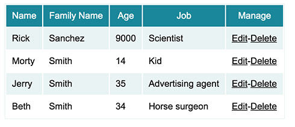
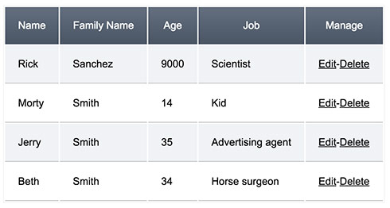
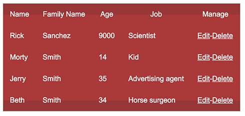
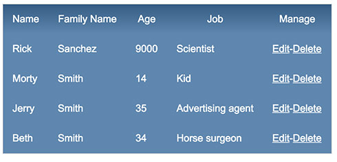
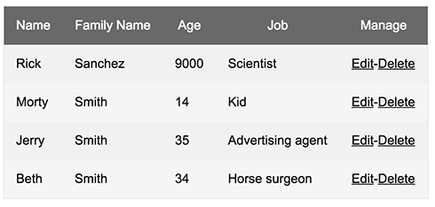
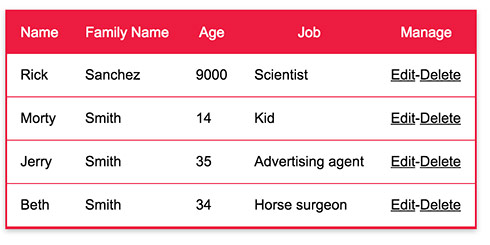

# React Easy Table
- Tiny component - less than 1.5KB
- Easy to use.
- Easy to customize.
- 6 different themes, or no theme at all - up to you.

Simple and Easy to use React Table, all you need is:
- Follow the How To Use (and install) process.


## How To Use
1. Install with `npm install react-easy-table --save`.
2. Import to your "js" file: `import EasyTable from 'react-easy-table';` (import css theme style, optional: `import 'react-easy-table/sharp-ocean.css';`).
3. In your code, use like that: `<EasyTable data={data} tHead={tHead}/>`.
4. Build `array` of th header titles (`tHead`).
5. `Data` object with all your table data.
6. Assign `array` items (table titles) to `data` object keys with `assignTo` inside the array of the header titles.
7. See `example/basic.js` for more info.

## Example

The Table Titles:
```
const tHead = [
    {
        title: 'Name',
        assignTo: 'name',   // assign table title "Name" to the data object "name"
        id: 'table-title'
    },
    {
        title: 'Family Name',
        assignTo: 'family_name',    // assign table title "Family Name" to "family_name" inside our data model.
        id: 'family_name'
    }
];
```

The Data Object:
```
const data = [
    { name: 'Rick', family_name: 'Sanchez', id:1 },
    { name: 'Morty', family_name: 'Smith', id:2 },
    { name: 'Jerry', family_name: 'Smith', id:3 },
    { name: 'Beth', family_name: 'Smith', id:4 }
];
```

How to use the Table:
```
<EasyTable tHead={tHead}
    data={data}/>
```

See more complex examples inside `examples/basic.js`.

## Features
1. Generate dynaic table easily. Feed it with Table Header array and Data object.
2. Customize Call To Action & Handlers (For example, edit buttons intside the table etc...).

## Todo
1. Add Pagination.
2. Add server side lazy load support.
3. Add Customize Filters.
4. Create basic theme.

## Bugs

## Screenshot && Themes

| basic        | sharp-Ocean           |
| ------------- |:-------------:|
|       |    |

| edgy-red        | blue           |
| ------------- |:-------------:|
|       |    |

| gray        | pink-head           |
| ------------- |:-------------:|
|       |    |

In order to use any of those themes, all you have to do is to add and import the `css` like that:

```
import EasyTable from 'easyTable'; // regular table import
import 'easyTable/sharp-ocean.css'; // theme name - gray/edgy-red/basic... etc.
```

## How to Contribute
1. Fork the project (top right button, in github UI).
2. Clone the forked repository to your machine.
3. Run `npm install`.
4. Run `npm start` (or better `npm run demon` in case you have `nodemon`, otherwise run `npm install nodemon -g`).
5. Create a new branch.
6. Go to `http://localhost:3355/`.
7. Write your code, commit and push to your own forked repository in the new branch.
8. Open a PR and wait for someone to review and merge to master.